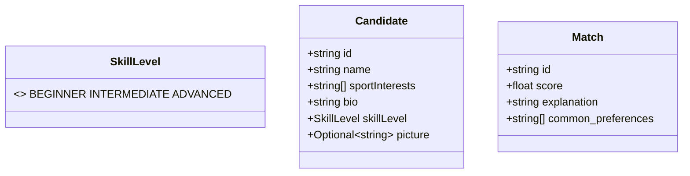

# GenAI Microservice

This service provides a REST API for AI-powered user matching using an LLM (via Open WebUI API).

## Features
- **/genai/match** endpoint: Given a user profile and a list of candidate users, returns a ranked list of structured match objects (with id, score, explanation, and common preferences) using an LLM.
- Pure FastAPI implementation, ready for containerized deployment.

## Usage

### 1. Environment Variables
You must supply the following variables (either in a `.env` file or via your orchestrator):

- `OPENWEBUI_URL` – Base URL of your Open WebUI instance (e.g. `https://gpu.aet.cit.tum.de`)
- `OPENWEBUI_API_KEY` – Bearer token for Open WebUI API access


**Recommended:**
- Define these in a `.env` file in the **project root** (the same directory as `docker-compose.yml`). Docker Compose will automatically load them for all services.


### 2. Build & Run (Docker Compose)

```sh
docker compose up --build genai
```

### 3. API Example

#### POST /genai/match
Request body:
```json
{
  "user_profile": {"id": "user1", "name": "user", "sportInterests": ["Tennis", "Swimming"], "bio": "I love tennis and swimming", "skillLevel": "Beginner"},
  "candidates": [
    {"id": "u1", "name": "Bob", "sportInterests": ["Tennis", "Swimming"], "bio": "I love tennis and swimming", "skillLevel": "Beginner"},
    {"id": "u2", "name": "Carol", "sportInterests": ["Chess", "Reading"], "bio": "I love chess and reading", "skillLevel": "Beginner"}
  ]
}
```
Response:
```json
{
  "matches": [
    {
      "id": "u1",
      "score": 0.92,
      "explanation": "Both enjoy tennis",
      "common_preferences": ["Tennis"]
    },
    {
      "id": "u2",
      "score": 0.4,
      "explanation": "No common sports",
      "common_preferences": []
    }
  ]
}
```

### 4. Testing
- See `tests/test_matching.py` for endpoint tests. These check that the `/genai/match` endpoint returns the correct schema (list of match objects with `id`, `score`, `explanation`, `common_preferences`).
- The output of the LLM is not strictly deterministic; tests validate response structure and types, not exact values.

### 5. Internal Logic
- Matching logic is implemented in `matching_engine.py`, which calls `openwebui_client.py` to interact with the LLM API.
- The LLM is prompted to return only a strict JSON array of match objects.
- All parsing and error handling is defensive to handle LLM quirks.

### 6. Prompt Design & Data Model

The matching prompt is carefully engineered to keep the LLM focused and to guarantee a parse-able response:

1. **System Instruction** – establishes the LLM persona and output contract:
   ```text
   You are a matchmaking engine. Return ONLY a valid JSON array. Each element must have
   id (string), score (float 0-1), explanation (string), common_preferences (string[]). No prose.
   ```
2. **User Section** – embeds the request payload as JSON (verbatim). We include:
   - `user_profile` – full user object.
   - `candidates` – **array of candidate objects** with all required fields (`id`, `name`, `sportInterests`, `bio`, `skillLevel`, `picture`).

   This is rendered with triple back-ticks so the model treats it as code and does not re-format it.

3. **Few-Shot Example** – a miniature example (one user + two candidates) with the **desired JSON answer**. This anchors the output schema and ordering.

4. **Explicit Rules** – reiterated in bold: *"Return ONLY JSON – do NOT add markdown, explanations, or keys outside the schema."*

**Why this works:**
- The model sees the schema three times (system, example, rules), drastically reducing chances of hallucinated keys.
- Using JSON in the prompt avoids the cost of re-serialising Python dataclasses and keeps typing explicit.

### Internal Data Model (Pydantic)



- `extra = "forbid"` is **disabled** to tolerate future fields (e.g., avatar URLs) without breaking requests.
- Validation happens **before** hitting the LLM so runtime errors never propagate downstream.
- The returned JSON is validated against the `Match` model; if the LLM drifts, we retry with a harsher system prompt.


## Development
- Main entrypoint: `app.py` (FastAPI)
- API routes: `routes/matching.py`
- LLM logic: `openwebui_client.py`, `matching_engine.py`

## Notes
- All secrets (API keys) should be kept out of version control. Only commit `.env.example`.
- For more Open WebUI API info, see: https://docs.openwebui.com/getting-started/api-endpoints/
